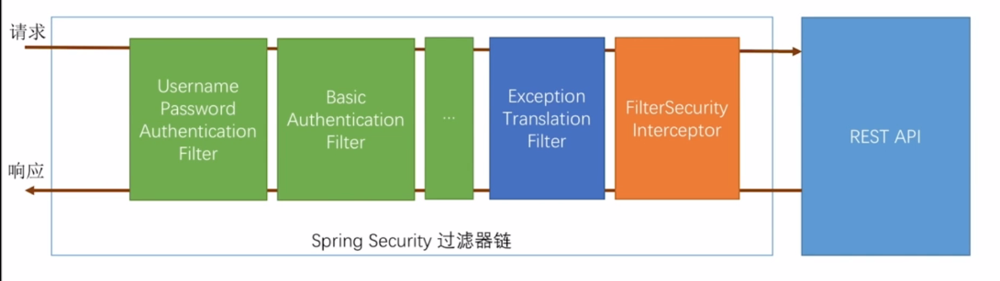
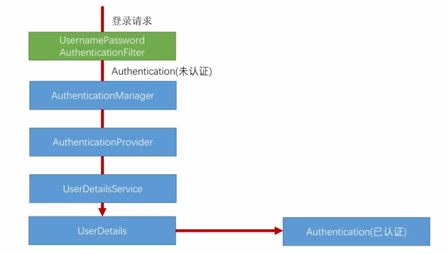
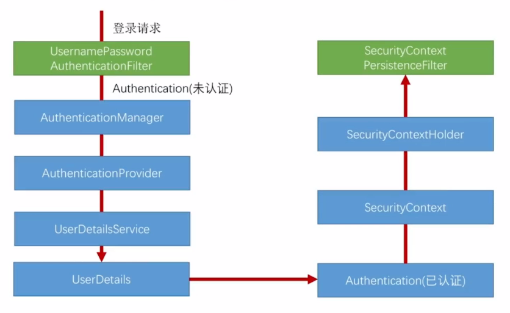
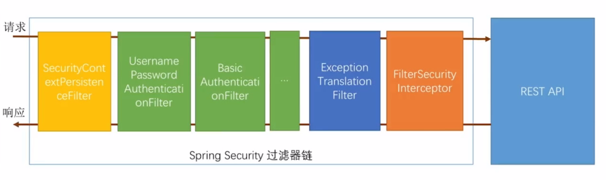
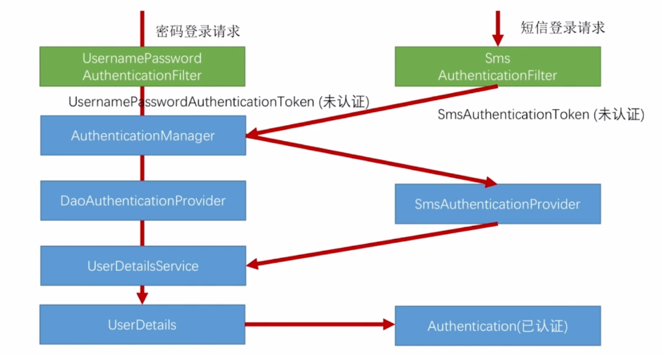

# spring security 基本逻辑(stu-spring-security-basic)
### 基础配置
配置form表单模式登陆请求关键代码如下,如果配置这些则调用spring security内置的表单登陆,系统启动时会默认在控制台提供一个登陆密码(账号user)
```
 http.formLogin()  // 表单登陆
    .and()  
    .authorizeRequests()  // 队请求进行授权 
    .anyRequest()  // 任何请求
    .authenticated(); // 都需要身份认证
```
### 基本原理
spring secutiry是利用一组过滤器链来完成请求的拦截以控制登陆和权限,其中最主要的过滤器如下

### 源码执行流程
1. 发起一个用户请求 localhost:8080/user/me
2. 跳转到FilterSecurityinterceptor.java 124行 *InterceptorStatusToken token = super.beforeInvocation(fi);* 抛出异常
3. ExceptionTranslationFilter 捕获异常，重定向到默认的登陆页面
4. 输入用户名密码登陆 用户名user 密码系统启动时控制台有
5. 跳转到UsernamePasswordAuthenticationFilter.java验证用户信息
6. 执行到FilterSecurityinterceptor.java，其中有个跳转的过程，转发到原来的请求上
7. 执行user/me请求

# 自定义登陆流程(stu-spring-security-custom-login)
### 认证处理流程说明

1. UsernamePasswordAuthenticationFilter.attemptAuthentication函数用于验证表单登陆认证过滤器
2. 初始化UsernamePasswordAuthenticationToken,设置权限为空,存储账号密码信息,设置认证状态为false
3. setDetails(request, authRequest);设置请求信息到token中去,包括请求信息,session信息等
4. 调用AuthenticationManager,这个类是用来管理AuthenticationProvider的,循环providers,看是否支持当前请求并执行,具体实现类为ProviderManager.authenticate
5. AuthenticationProvider用于检验用户,调用authenticate,实际引用类为DaoAuthenticationProvider,首先调用父类AbstractUserDetailsAuthenticationProvider.authenticate
6. 获取UserDetails对象,调用DaoAuthenticationProvider.retrieveUser,执行代码this.getUserDetailsService().loadUserByUsername,调用UserDetailservice的实现
7. AbstractUserDetailsAuthenticationProvider--preAuthenticationChecks.check(user);预检查用户检查用户状态
8. additionalAuthenticationChecks 其他身份检查,检查密码是否匹配
9. postAuthenticationChecks.check(user); 检查用户锁定状态
10. 所有检查通过createSuccessAuthentication(principalToReturn, authentication, user)创建一个成功认证处理器
11. 重新初始化UsernamePasswordAuthenticationToken,设置权限,设置认证状态为true
12. AbstractAuthenticationProcessingFilter.doFilter继续执行如果登陆成功调用successfulAuthentication失败捕获异常调用unsuccessfulAuthentication
### 认证结果如何在多个请求之间共享

登陆请求认证成功后会调用AbstractAuthenticationProcessingFilter.successfulAuthentication方法SecurityContextHolder.getContext().setAuthentication(authResult)这段代码为SecurityContext设置认证对象(Authentication)

通过SecurityContextPersistenceFilter过滤器进入系统时,检查session中有没有SecurityContext,如果有就把SecurityContext放到线程里，请求响应完了如果线程中有认证信息则放入到session中,这样不同的请求就可以共享用户信息
### 如果获取用户信息
1. 调用SecurityContextHolder.getContext().getAuthentication();
2. 在controller参数中加入Authentication参数
3. 直接获取UserDetails,在controller参数中加入 @AuthenticationPrincipal UserDetails

# 自定义短信认证流程(stu-spring-security-sms-login)

1. 设置ValidateCodeFilter拦截器验证短信验证码是否正确
2. 注册短信验证码认证配置文件SmsCodeAuthenticationSecurityConfig
3. SmsAuthenticationFilter替换密码请求认证过滤器UsernamePasswordAuthenticationFilter
,SmsCodeAuthenticationProvider替换DaoAuthenticationProvider
4. 其他流程参照自定义认证流程